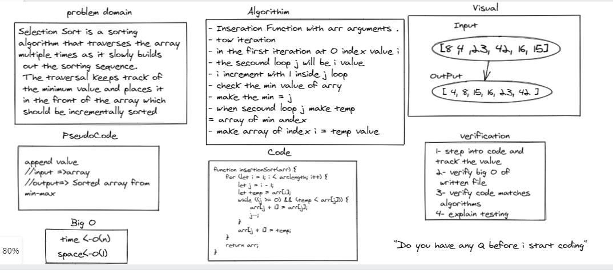

# Insertion Sort

Selection Sort is a sorting algorithm that traverses the array multiple times as it slowly builds out the sorting sequence. The traversal keeps track of the minimum value and places it in the front of the array which should be incrementally sorted.

## Whiteboard Process

<!-- Embedded whiteboard image -->

## Approach & Efficiency

- Inseration Function with arr arguments . 
- tow iteration 
- in the first iteration at 0 index value i 
- the secound loop j will be i value 
- i increment with 1 inside j loop 
- check the min value of arry 
- make the min = j 
- when secound loop j make temp 
= array of min andex 
- make array of index i = temp value

