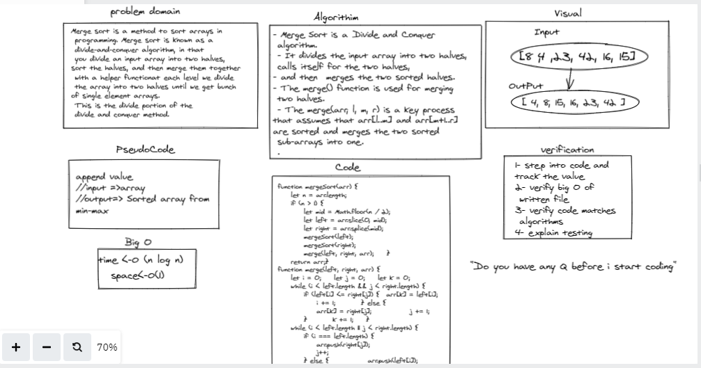

# Merge sort

Merge sort is one of the most popular sorting algorithms today and it uses the concept of divide and conquer to sort a list of elements. Meaning, it will divide the bigger problem into smaller problems and then solve each of the small problems in order to solve the bigger problem that we started out with.
## Whiteboard Process

<!-- Embedded whiteboard image -->

## Approach & Efficiency

 at each level we divide the array into two halves until we get bunch of single element arrays. This is the divide portion of the divide and conquer method. Then, we start merging and sorting the smaller arrays in a series of steps which is the conquer portion of divide and conquer

