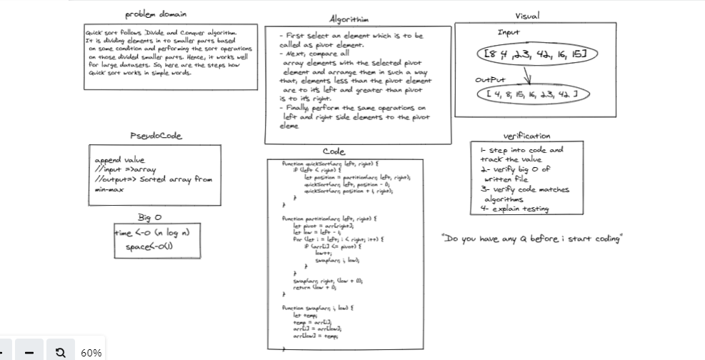

# Quick Sort

Quick Sort is a programming algorithm to sort an array. It is known as a divide and conquer method in that you take an array and split it. In the following pseudocode we start the algorithm with an array, the leftmost value of the array, and the rightmost value of the array. This method is recursive, and alters the array in place.

## Whiteboard Process

<!-- Embedded whiteboard image -->

## Approach & Efficiency

Quick sort follows Divide and Conquer algorithm. It is dividing elements in to smaller parts based on some condition and performing the sort operations on those divided smaller parts. Hence, it works well for large datasets. So, here are the steps how Quick sort works in simple words.

