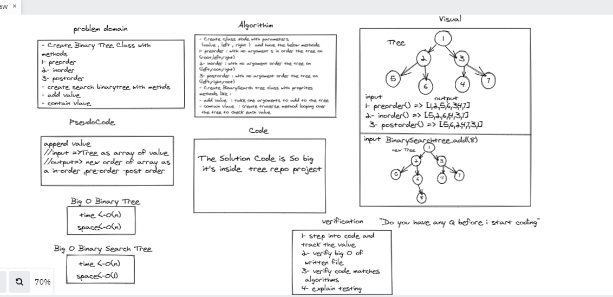

# Challenge Summary
- Create Binary Tree Class with 
methods  
1- preorder 
2- inorder 
3- postorder 
- create search binarytree with methds 
- add value 
- contain vlaue 

## Whiteboard Process

 > Whiteboard Binary Tree  & BinarySearch . 
 

## Approach & Efficiency : 
- Create c;lass Node with parameters
 (value , left , right )  and have the below methode 
1- preorder : with no argoment s in order the tree on 
(root,left,right)
2- inorder : with no argoment order the tree on 
(left,root,right)
3- postorder : with no argoment order the tree on 
(left,right,root)
- Create BinarySearch tree class with proprites 
methods like : 
- add value  : take one argoments to add to the tree 
- contain vlaue  : create traverse method looping over
 the tree to check each value 

