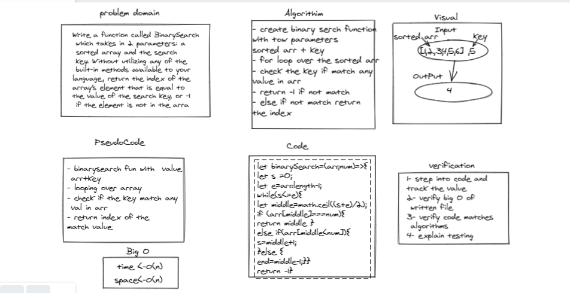

# Reverse an Array

Write a function called BinarySearch which takes in 2 parameters: a sorted array and the search key. Without utilizing any of the built-in methods available to your language, return the index of the array’s element that is equal to the value of the search key, or -1 if the element is not in the array.

### Whiteboard Process

### Approach & Efficiency

- create binary serch function
with tow parameters 
sorted arr + key 
- for loop over the sorted arr 
- check the key if match any 
value in arr 
- return -1 if not match 
- else if not match return 
the index 