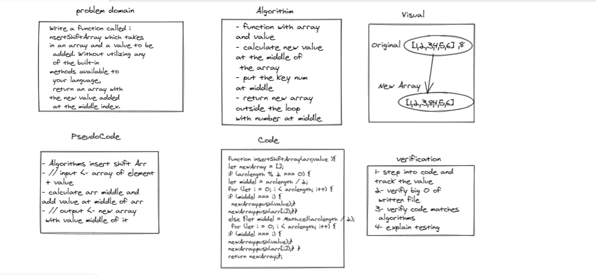

# Reverse an Array

Write a function called insertShiftArray which takes in an array and a value to be added. Without utilizing any of the built-in methods available to your language, return an array with the new value added at the middle index.

### Whiteboard Process

### Approach & Efficiency

- function with array and value 
- calculate new value at the middle of the array 
- put the key num at middle
- return new array outside the loop
with number at middle  