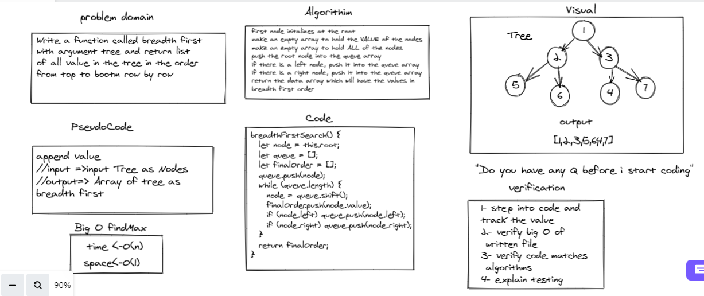

# Challenge Summary
Write a function called breadth first 
with argument tree and return list 
of all value in the tree in the order 
from top to bootm row by row 

## Whiteboard Process

 > Whiteboard breadth first . 
 

## Approach & Efficiency : 
first node initalizes at the root
make an empty array to hold the VALUE of the nodes
make an empty array to hold ALL of the nodes
push the root node into the queue array
if there is a left node, push it into the queue array
if there is a right node, push it into the queue array
return the data array which will have the values in 

