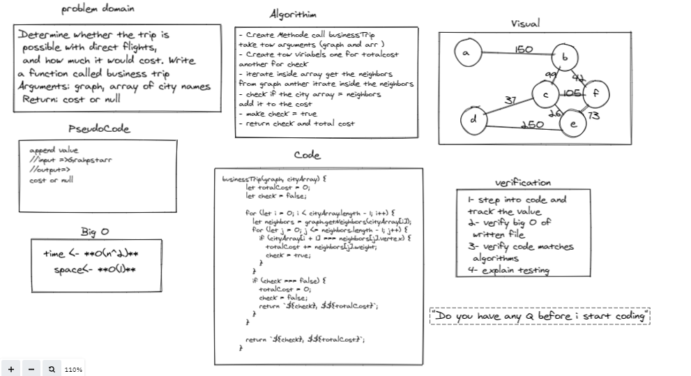

# BT-Graph

Write a function called business trip
Arguments: graph, array of city names
Return: cost or null

## Whiteboard Process

## Approach & Efficiency

## Big O
Time
- **O(n^2)** 
Space
- **O(1)**
