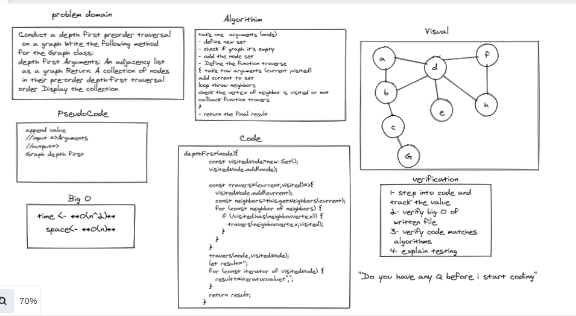

# depth first Graph

Conduct a depth first preorder traversal
 on a graph Write the following method 
for the Graph class:
depth first Arguments: An adjacency list
 as a graph Return: A collection of nodes
 in their pre-order depth-first traversal 
order Display the collection

## Whiteboard Process

## Approach & Efficiency
take one  arguments (node) 
- define new set
- check if graph it's empty 
- add the node set 
- Define the function traverse 
{ take tow arguments (current ,visited)
add current to set 
loop throw neighbors
check the vertex of neighbor is visited or not 
callback function travers 
}
- return the final result 

## Big O
- time <- **O(n^2)** 
- space<- **O(n)** 
