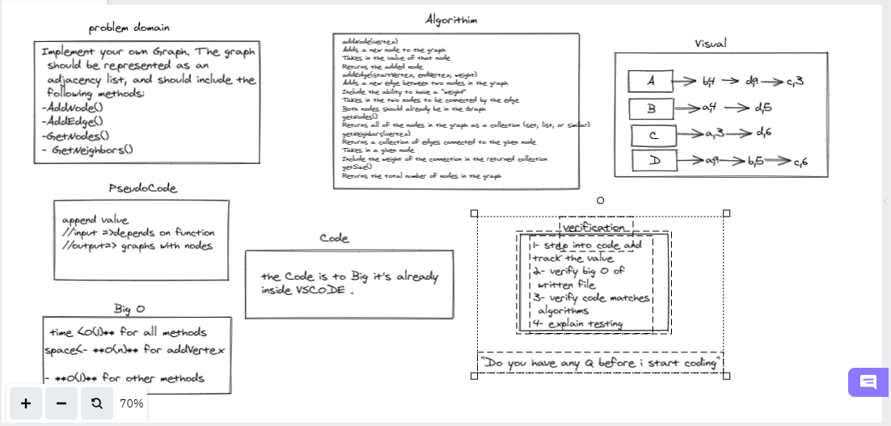

# Graph

<!-- Description of the challenge -->

Implement your own Graph. The graph should be represented as an adjacency list, and should include the following methods:

- add node
- add edge
- get nodes
- get neighbors
- size

## Whiteboard Process

## Approach & Efficiency

## Big O
- time <O(1)** for all methods 
- space<- **O(n)** for addVertex
 **O(1)** for other methods
