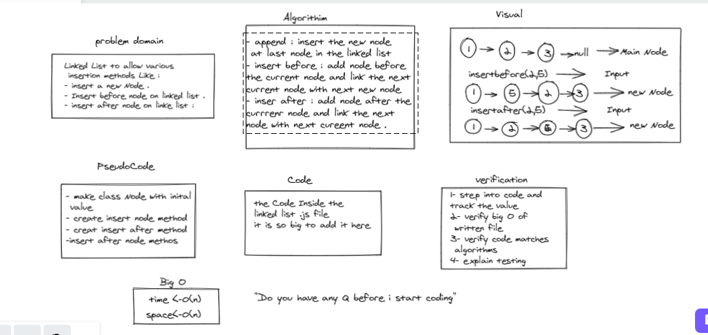

# Challenge Summary
Linked List to allow various insertion methods Like : 
- insert a new Node . 
- Insert before node on linked list . 
- insert after node on linke list : 

## Whiteboard Process

## Approach & Efficiency : 

- insert method take one paramter to insert the node in the first linkedlist and have to pointer on it as a new node the head and tails . 

- insertafter method take tow  paramter to insert the node after selected node on linked list  . 

- insertbefore method take tow  paramter to insert the node before selected node on linked list  . 

- tostring with no paramter looping to all linked list  to rerutn all item in linked list . 

