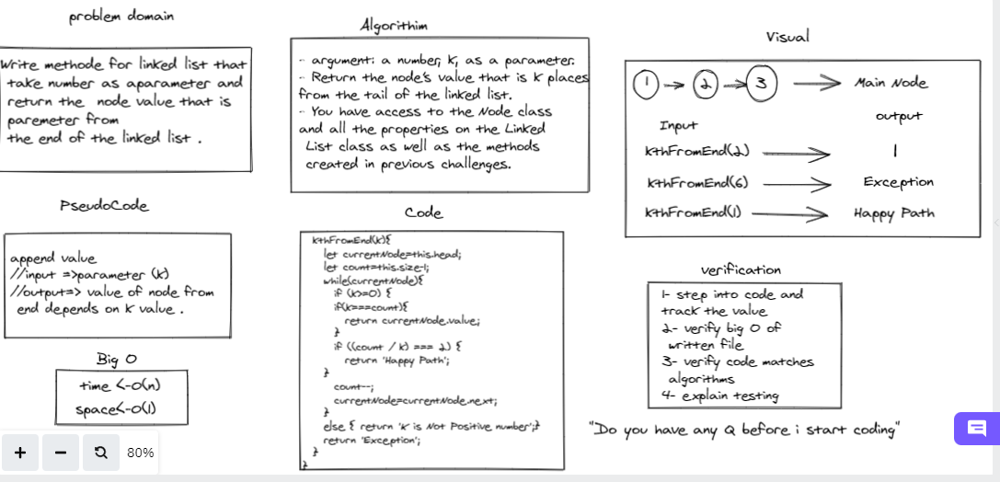

# Challenge Summary
Linked List to allow various methods Like 
kth from end
argument: a number, k, as a parameter.
Return the node’s value that is k places from the tail of the linked list.
You have access to the Node class and all the properties on the Linked List class as well as the methods created in previous challenges.

## Whiteboard Process

## Approach & Efficiency : 
- Write methode for linked list that
 take number as aparameter and
 return the  node value that is
 paremeter from  the end of the linked list .  
- using if statments to check and while loop to looping over the linked list . 

