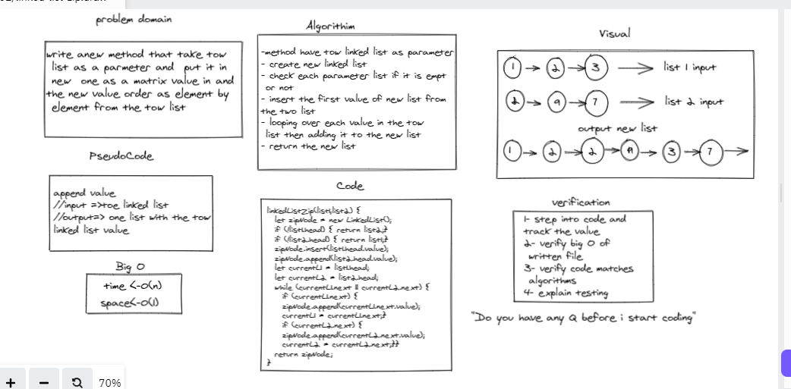

# Challenge Summary
Linked List to allow various methods Like 
write anew method that take tow
 list as a parmeter and  put it in
 new  one as a matrix value in and 
the new value order as element by
 element from the tow list 

## Whiteboard Process

## Approach & Efficiency : 
-method have tow linked list as parameter
- create new linked list 
- check each parameter list if it is empt
 or not 
- insert the first value of new list from 
the two list 
- looping over each value in the tow
 list then adding it to the new list 
- return the new list 
