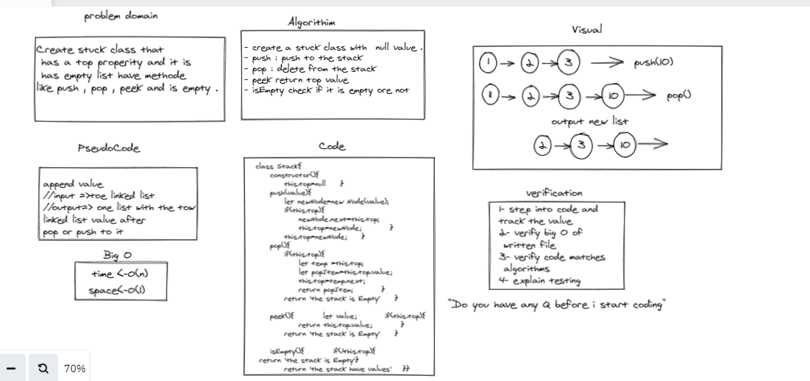
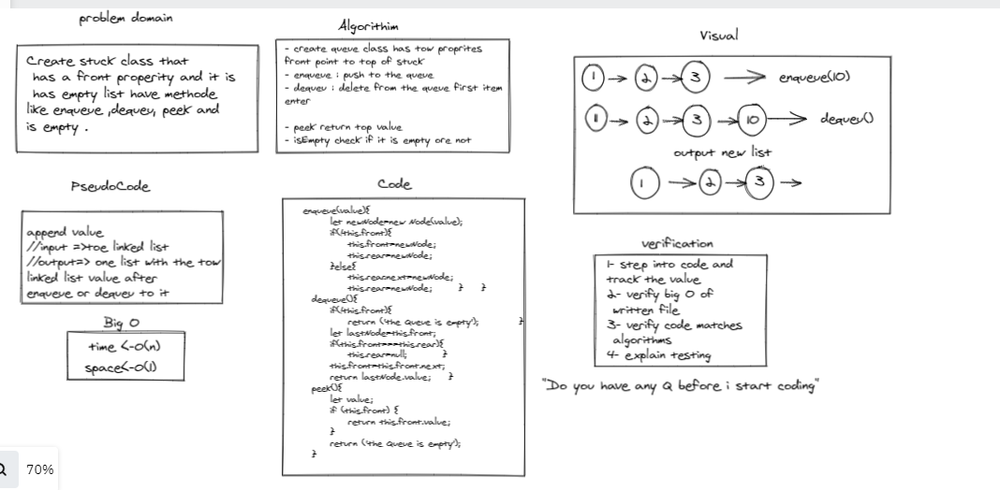

# Challenge Summary
Using a Linked List as the underlying data 

storage mechanism, implement both a Stack and a Queue

## Whiteboard Process
 > Whiteboard Stack

 > Whiteboard Queue

## Approach & Efficiency : 

 > method Stack
- create queue class has tow proprites
front point to top of stuck 
- enqueue : push to the queue 
- dequeu : delete from the queue first item
enter 
- peek return top value  
- isEmpty check if it is empty ore not 

 > method Queue
- create queue class has tow proprites
front point to top of stuck 
- enqueue : push to the queue 
- dequeu : delete from the queue first item
enter 

- peek return top value  
- isEmpty check if it is empty ore not 

