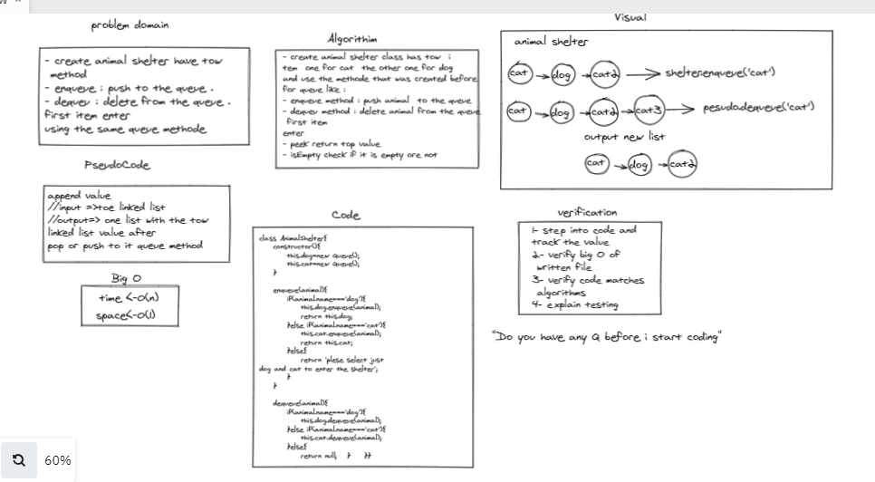

# Challenge Summary
- create animal shelter class has tow 
item  one for cat  the other one for dog
and use the methode that was created before
for queue like : 
- enqueue method : push animal  to the queue 
- dequeu method : delete animal from the queue
 first item
enter 
- peek return top value  
- isEmpty check if it is empty ore not 

## Whiteboard Process

 > Whiteboard animal shelter Using Queue . 
 

## Approach & Efficiency : 
- enqueue method : push animal  to the queue 
- dequeu method : delete animal from the queue

