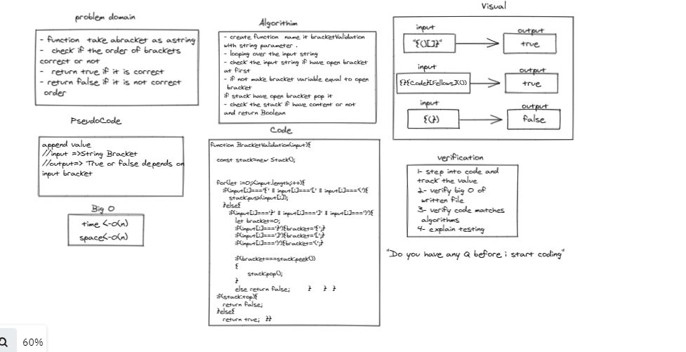

# Challenge Summary
- function  take abracket as astring 
-  check if the order of brackets 
correct or not 
-  return true if it is correct 
- return false if it is not correct
 order  

## Whiteboard Process

 > Whiteboard BracketValidation Using Stack . 
 

## Approach & Efficiency : 
- create function  name it bracketValidation 
with string parameter . 
- looping over the input string 
- check the input string if have open bracket 
at first  
- if not make bracket variable equal to open
 bracket 
if stack have open bracket pop it 
- check the stack if have content or not 
and return Boolean 

