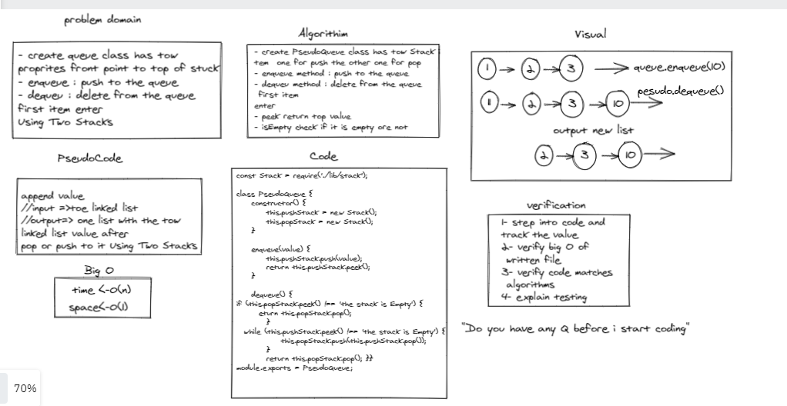

# Challenge Summary
- create queue class has tow 
proprites front point to top of stuck 
- enqueue : push to the queue 
- dequeu : delete from the queue 
first item enter  
- Using Two Stacks 

## Whiteboard Process

 > Whiteboard  Queue Using Tow Stack
 

## Approach & Efficiency : 
- create PseudoQueue class has tow Stack i
tem  one for push the other one for pop
- enqueue method : push to the queue 
- dequeu method : delete from the queue
 first item  enter 

