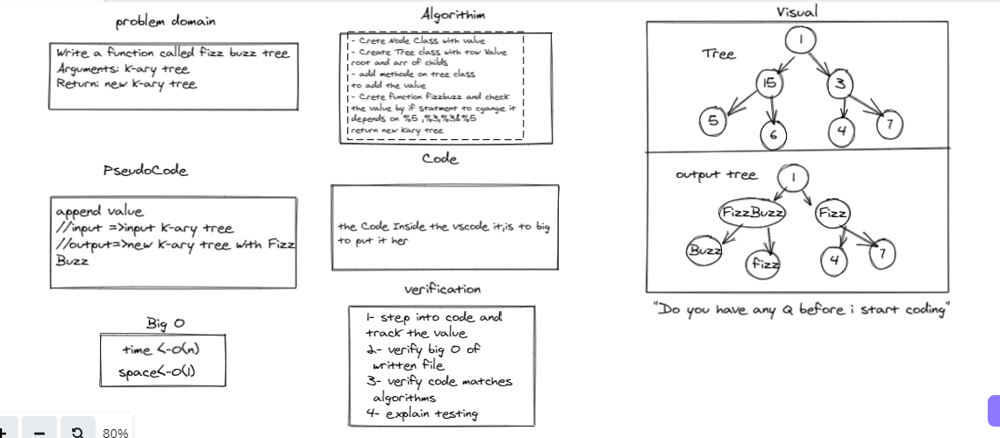

# Challenge Summary
Write a function called fizz buzz tree
Arguments: k-ary tree
Return: new k-ary tree

## Whiteboard Process

 > Whiteboard Kary Tree . 
 

## Approach & Efficiency : 
- Crete Node Class with value 
- Create Tree class with tow Value 
root and arr of childs 
- add methode on tree class 
to add the value 
- Crete function fizzbuzz and check 
the value by if statment to cgange it 
depends on %5 ,%3,%3&%5 
return new kary tree 

