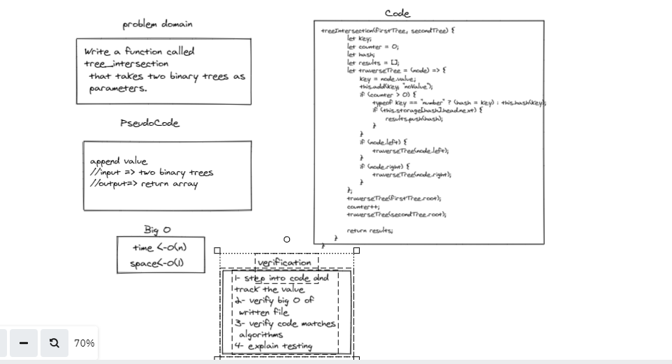

# Hashmap Tree Intersection

Write a function called tree_intersection that takes two binary trees as parameters.
Using your Hashmap implementation as a part of your algorithm, return a set of values found in both trees.

Write a function called tree intersection
Arguments: two binary trees
Return: array

## Whiteboard Process

## Approach & Efficiency

# Big O
- Time :  O(n)
- Space :  O(1)